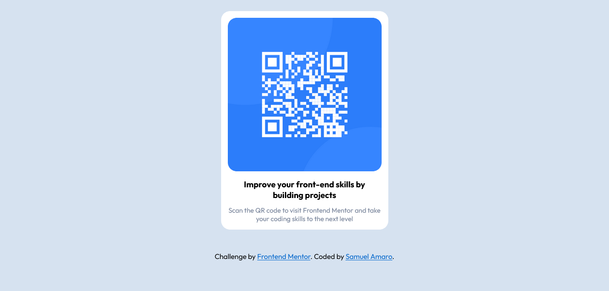

# Frontend Mentor - solução de componente de código QR

Esta é uma solução para o [desafio do componente de código QR no Frontend Mentor](https://www.frontendmentor.io/challenges/qr-code-component-iux_sIO_H). Os desafios do Frontend Mentor ajudam você a melhorar suas habilidades de codificação criando projetos realistas.

## Índice

- [Visão geral](#visão-geral)
  - [Captura de tela](#captura-de-tela)
  - [Links](#links)
- [Meu processo](#meu-processo)
  - [Construído com](#construído-com)
  - [O que aprendi](#o-que-aprendi)
- [Autor](#autor)

## Visão geral

### Captura de tela

### Links

- URL da solução: [qr-code-component](https://github.com/Samuel-Amaro/qr-code-component)
- URL do site ao vivo: [Adicione o URL do site ao vivo aqui](https://your-live-site-url.com)

## Meu processo

### Construído com

- Marcação HTML5 semântica
- Propriedades personalizadas de CSS

### O que eu aprendi

Neste projeto por ter um caráter simples, foi de muito valor para aprender e usar propriedades css fundamentais que são muito utilizadas. Não utilizei técnicas de layout e nem design responsivo, somente propriedades css simples para alcançar o resultado esperado.

## Autor

- Site - [Samuel Amaro](https://github.com/Samuel-Amaro)
- front end mentor - [@Samuel-Amaro](https://www.frontendmentor.io/profile/seunomedeusuário)
